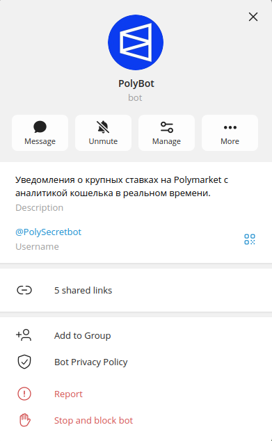
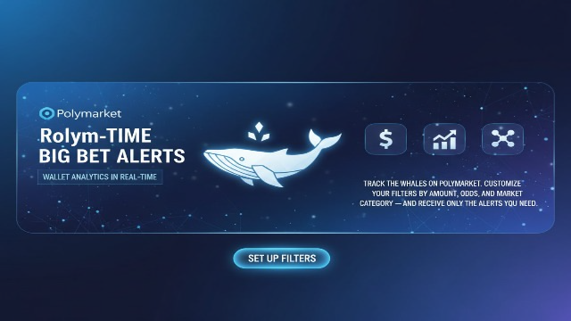
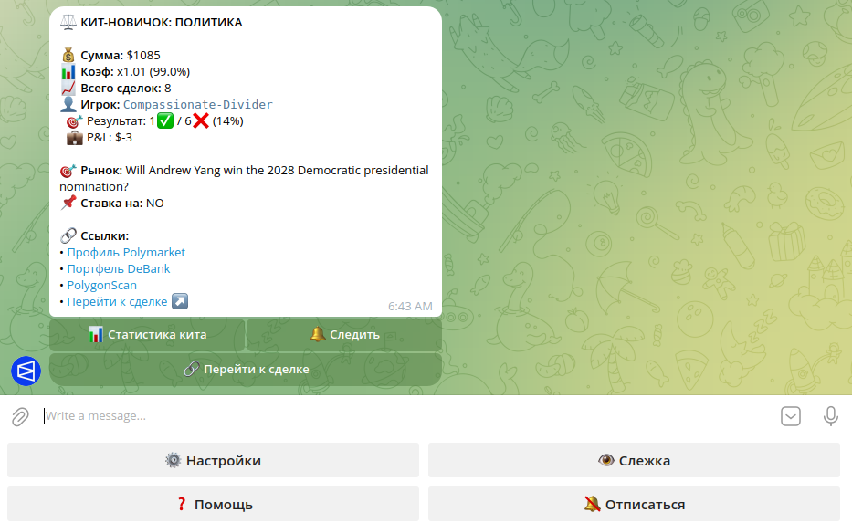
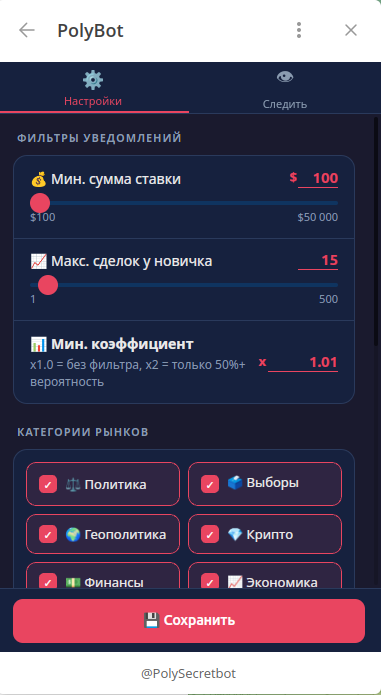
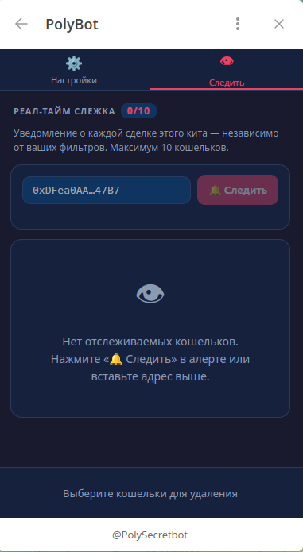
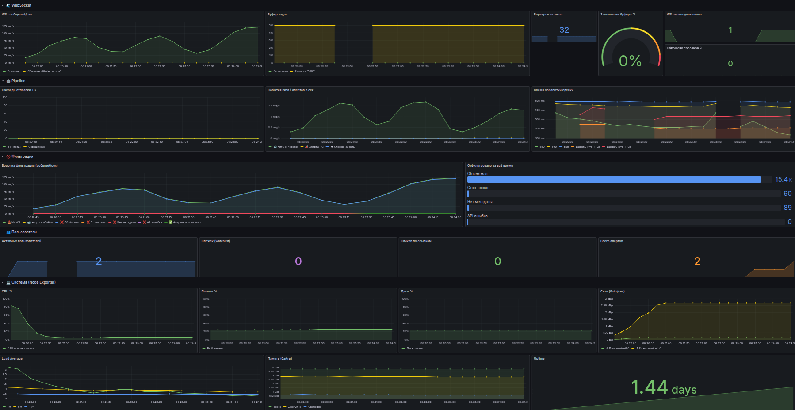

# Polymarket Whale Tracker — Telegram Bot

## Project Overview

**Polymarket Whale Tracker** is a real-time Telegram bot that monitors large trades by new participants ("whales") on the Polymarket prediction market and delivers instant personalized alerts to subscribers.

The bot connects directly to Polymarket's WebSocket feed and processes every trade in real time, filtering for significant activity from new players — the kind of traders whose moves signal high-conviction bets and are most interesting to follow. Users receive rich alerts with wallet statistics, P&L, win rate, and one-click access to the market and trader profile.

---

## Table of Contents

- [Problem](#problem)
- [Solution](#solution)
- [Key Features](#key-features)
  - [For users](#for-users)
  - [Technical](#technical)
- [Architecture](#architecture)
- [Telegram Bot Interface](#telegram-bot-interface)
- [Settings & Watchlist (Mini App)](#settings--watchlist-mini-app)
- [Monitoring Dashboard](#monitoring-dashboard)
- [Tech Stack](#tech-stack)
- [Data Sources Used](#data-sources-used)
- [Impact on Polymarket Ecosystem](#impact-on-polymarket-ecosystem)
- [Current Status](#current-status)
- [Roadmap](#roadmap)
- [Grant Request](#grant-request)
- [Links](#links)

---

## Problem

Polymarket has hundreds of active markets and thousands of trades per day. For a regular user, it is virtually impossible to manually monitor when a new high-stakes player enters a market. Yet these moments are among the most actionable signals in prediction markets — a large bet by an unknown wallet placing $10,000+ on a 30% outcome deserves attention.

There is no native Polymarket notification system for this kind of activity. Users either have to constantly refresh the website or miss these opportunities entirely.

---

## Solution

The bot solves this by doing three things:

1. **Real-time detection** — subscribes to Polymarket's WebSocket and processes every trade as it happens, with no polling delay.
2. **Intelligent filtering** — each user sets their own filters (minimum bet size, maximum trade count to define "newbie", minimum odds, market categories). Only relevant alerts are delivered.
3. **Rich context** — every alert includes the wallet's all-time P&L, win rate, number of past trades, market category, odds, transaction hash, and links to Polymarket profile, DeBank portfolio, and PolygonScan.

---

## Key Features

### For users
- **Instant whale alerts** with full wallet context (W/L ratio, total P&L, trade history)
- **Fully personalized filters**: minimum bet amount, "newbie" threshold (max N trades ever), minimum odds multiplier, and market categories
- **20 market categories** supported: politics, elections, crypto, finance, economy, geopolitics, tech, culture, sports (NBA, NFL, NHL, UFC, tennis, esports, cricket, rugby, baseball, table tennis, and more)
- **Wallet watchlist** — follow up to 10 specific wallets and receive a dedicated notification every time they trade, regardless of your global filters (watchlist alerts bypass all volume/odds/category filters)
- **Telegram Mini App** for settings management — sliders, manual input, category selector with Telegram CloudStorage sync (category selections persist across sessions automatically)
- **One-click navigation** — inline buttons in every alert to view market, check DeBank portfolio, and inspect the transaction on PolygonScan

### Technical
- **WebSocket → worker pool** architecture: 32 parallel Go goroutines consume a 5,000-item buffered channel, ensuring no trades are missed even during traffic spikes
- **In-memory follow cache** — watchlist data is cached in memory and refreshed every 30 seconds; no database query per trade for instant follow detection
- **Redis caching** — wallet stats cached 15 minutes, trade counts 10 minutes; Polymarket API is never hammered
- **PostgreSQL** for persistent user data (settings, watchlist, click tracking)
- **Prometheus + Grafana** — comprehensive metrics dashboard with alert volume, processing lag, buffer fill, click analytics, and system resources
- **Docker Compose** — fully containerized, one-command deployment
- **CI/CD automation** — GitHub Actions workflow for automatic deployment on git push (zero-downtime updates)

---

## Architecture

```
Polymarket WebSocket
        │
        ▼
   jobs channel (5,000 buffer)
        │
   ┌────┴────┐
   │ Workers │  ×32 goroutines
   └────┬────┘
        │  per trade:
        │  1. Check watchlist (in-memory cache, 30s refresh)
        │  2. Volume pre-filter — skipped for watched wallets, applied for everyone else
        │  3. Ban-word filter (title) — applies to all trades incl. watched
        │  4. Category metadata (Redis-cached) — applies to all
        │  5. Trade count → newbie check (Redis-cached) — applies to all
        │  6. Wallet stats (Redis-cached, 15 min)
        │  7. SendAlert → followed wallets bypass per-user filters (amount/trades/odds/cats)
        ▼
   Telegram Bot API (25 msg/sec rate-limited queue)
```

---

## Telegram Bot Interface

### Bot profile and description screen

The bot profile and the description screen shown when a user opens the chat for the first time:





### Alert message with inline buttons

Every whale alert includes wallet context (P&L, win rate, trade count), market info, odds, and one-click buttons to view stats, follow the wallet, or jump to the trade on Polymarket:



---

## Settings & Watchlist (Mini App)

### Notification settings

Users configure filters directly in Telegram via a web-based Mini App — minimum bet amount, newbie threshold, minimum odds, and market category selection:



### Wallet watchlist

The watchlist section shows all followed wallets and allows removing them in bulk. Followed wallets bypass all filters — their trades are always delivered instantly:



---

## Monitoring Dashboard

Real-time Prometheus + Grafana dashboard with comprehensive analytics:

**📊 Operational Metrics:**
- WebSocket throughput and reconnection tracking
- Pipeline filtering funnel (volume, category, API errors)
- Alert delivery latency and processing time (p50/p90/p99)
- Send queue size and dropped messages
- System resources (CPU, RAM, disk, network)

**👥 User Analytics:**
- Total subscribers and active users (time-range filtered)
- Watchlist size and follow alerts
- Click tracking by link type (market, profile, DeBank, PolygonScan)

**🌍 Geographic & Category Intelligence:**
- Click distribution by country (automatic GeoIP detection)
- Most popular market categories by region (e.g., US users prefer politics, crypto traders follow DeFi markets)
- Category performance analysis (which topics drive the most engagement)
- Cross-regional trends in prediction market interests



---

## Tech Stack

| Component | Technology |
|-----------|-----------|
| Language | Go 1.25 |
| Telegram library | [telego](https://github.com/mymmrac/telego) |
| Database | PostgreSQL 15 |
| Cache | Redis 7 |
| Metrics | Prometheus + Grafana |
| Frontend (Mini App) | Vanilla HTML/JS, hosted on GitHub Pages |
| Infrastructure | Docker Compose |
| Data source | Polymarket WebSocket + REST API |

---

## Data Sources Used

All data comes exclusively from public Polymarket APIs:

- **WebSocket** `wss://ws-live-data.polymarket.com` — live trade feed
- `data-api.polymarket.com/traded?user=` — trade count per wallet
- `data-api.polymarket.com/v1/leaderboard?user=&timePeriod=ALL` — all-time P&L
- `data-api.polymarket.com/closed-positions?user=&limit=50&offset=N` — win/loss breakdown (paginated; API caps at 50 per page sorted by P&L desc)
- `gamma-api.polymarket.com/markets?slug=` — market category metadata

---

## Impact on Polymarket Ecosystem

**Increased engagement** — users who receive timely alerts visit Polymarket more often and are more likely to participate in markets they discover through the bot.

**New user acquisition** — the bot reaches Telegram users who may not have a habit of actively visiting the Polymarket website. Alerts with direct deep links into specific markets lower the barrier to entry.

**Market discovery** — by surfacing large bets across 20+ categories, the bot helps users discover markets they would not have found on their own, including niche sports, geopolitics, and emerging crypto events.

**Whale signal amplification** — when experienced traders (high P&L, strong win rate) make a large bet, the community benefits from knowing about it. The bot makes this information accessible instantly, contributing to better market efficiency.

**Community building** — the Telegram format is inherently social. Users discuss alerts in groups, share interesting wallets, and follow the same trades together — creating a community layer on top of Polymarket activity.

**Regional market intelligence for Polymarket** — the bot collects valuable geographic analytics that can be shared with Polymarket:
- Which regions engage with which market categories (e.g., US users prefer politics/elections, Asian markets follow crypto/finance)
- Geographic distribution of prediction market interest (country-level engagement patterns)
- Regional trends in whale activity and high-conviction bets
- Category performance by geography (which topics drive clicks in different countries)

This data helps Polymarket understand:
- Where to focus regional marketing campaigns
- Which market categories to promote in different countries
- Content localization opportunities (e.g., create more sports markets for regions that engage heavily with sports predictions)
- Emerging geographic markets for prediction trading

---

## Current Status

The bot is fully functional and deployed. It is actively processing Polymarket trades in real time and delivering alerts to subscribers. All core features are implemented:

- ✅ Real-time WebSocket trade processing
- ✅ Per-user personalized filters (amount, trades, odds, categories)
- ✅ Wallet statistics (P&L, win rate, trade history) via Polymarket API
- ✅ Wallet watchlist with real-time follow notifications (max 10 wallets)
- ✅ Telegram Mini App for settings (GitHub Pages, no server required)
- ✅ Rate-limited Telegram send queue (25 msg/sec, capacity 20,000)
- ✅ Prometheus/Grafana monitoring with comprehensive analytics (geo, category, performance)
- ✅ Full Docker Compose deployment
- ✅ Automated CI/CD deployment via GitHub Actions

---

## Roadmap

### Planned Features

**📊 Paper Trading / Test Balance**
- Virtual balance tracker to test whale-following strategies
- Users can "copy" whale trades with virtual funds to measure ROI before risking real money
- Historical performance tracking: see if following specific wallets would have been profitable
- Leaderboard of most profitable wallets to follow
- **Goal:** Let users validate the effectiveness of whale signals with data before committing capital

**🌐 Multi-language Support**
- English interface and alerts (currently Russian-only)
- Expand user base to global Polymarket community

**🎯 Enhanced Filtering by Whale Performance**
- Filter by minimum P&L (e.g., only show whales with +$5,000 total profit)
- Filter by win rate (e.g., only alert on whales with >60% win rate)
- Filter by total profit threshold (exclude losing whales entirely)
- Combined filters (e.g., "whales with +$10k profit AND 70%+ win rate")
- **Goal:** Let users follow only proven successful traders, not random large bets

**🔗 Advanced Wallet Analytics**
- On-chain wallet age detection
- Category-specific performance (e.g., "this wallet is 75% accurate in crypto markets")
- Open position size tracking
- Correlation analysis between whale bets and market outcomes
- Historical performance trends (improving vs declining traders)

**🤖 Smart Notifications**
- ML-based alert prioritization (learn which whale signals each user actually clicks)
- Notification grouping during high-volume periods
- "Whale consensus" alerts (when multiple followed wallets bet on the same outcome)

---

## Grant Request

The grant would be used to expand infrastructure and develop features that increase Polymarket user engagement:

### Infrastructure ($XXX/month)
1. **VPS hosting** — professional cloud server for 24/7 uptime with 99.9% SLA and low-latency connection to Polymarket's WebSocket
2. **Custom domain** — professional domain for redirect tracking, Mini App hosting, and public API endpoints
3. **Website development** — public landing page showcasing bot features, whale leaderboards, and onboarding tutorials
4. **Database scaling** — PostgreSQL managed instance for growing user base and historical analytics storage

### Feature Development
1. **Paper trading system** — virtual balance tracker to let users test whale-following strategies before using real money
   - Track hypothetical ROI from copying whale bets
   - Identify most profitable wallets to follow
   - Data-driven validation of whale signals
2. **English localization** — expand beyond Russian-speaking audience to reach global Polymarket community
3. **Advanced wallet analytics** — on-chain signals (wallet age, category-specific win rates, position sizing)
4. **Public API** — expose whale activity data to third-party developers and researchers

### Growth & Community
1. **Bot discovery campaigns** — Telegram community outreach in Polymarket/prediction market channels
2. **Educational content** — tutorials on interpreting whale signals and using the bot effectively
3. **Integration partnerships** — collaborate with Polymarket traders, analysts, and content creators

---

## Links

- **Telegram Mini App (settings UI):** https://wammero.github.io/poly_site/
- **Source code:** https://github.com/Wammero/PolyInsight
- **Telegram bot:** https://t.me/PolySecretbot